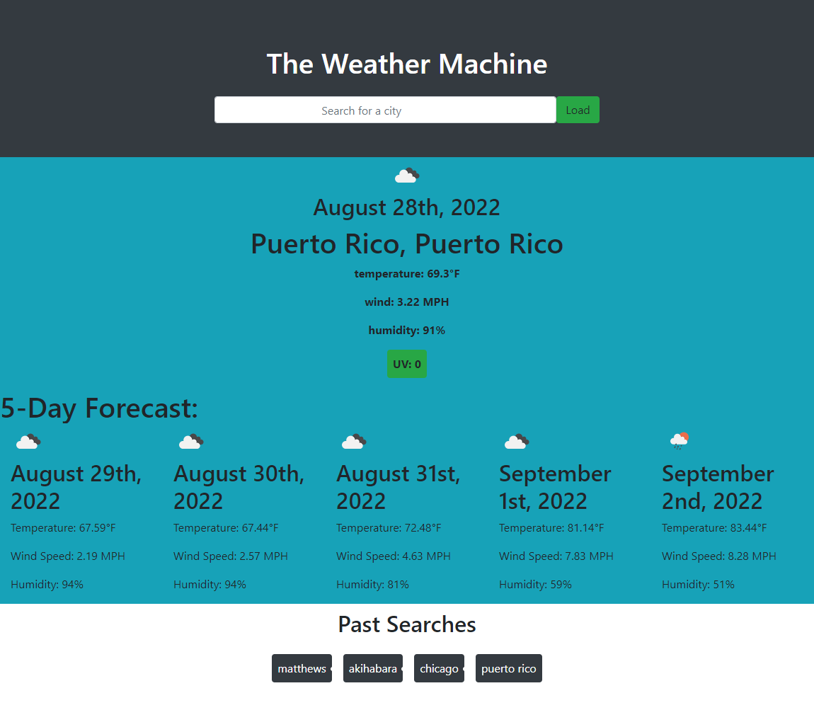

# Weather-Dashboard

## Table of Contents

1. [Description](#description)
2. [Visuals](#visuals)

## Description
This project is a weather dashboard made to be given a certain area and forecast the weather for the present day and for the next 5 days. Each one is shown the date, temperature in fahrenheit, wind speed in mils per hour and humidity. The current date has the UV index and the background color changes based on the severity of the index. In the bottom there is a past searches when you can click and get the information of that area you clicked on

[Link to Live Site](https://revilite.github.io/Weather-Dashboard/)
## Visuals

